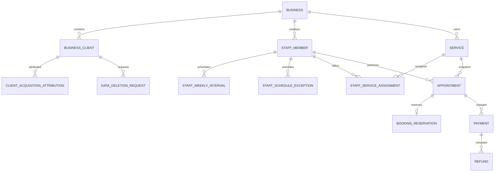

# Архитектура white-label Telegram CRM v0.4.0

Статус: разделы 1–17 сохраняют историю архитектурных решений v0.1–v0.3.1; раздел 18
описывает действующее коммерческое ядро v0.4.0.

## 1. Цели и границы базового MVP v0.1

v0.1.0 должна обеспечить устойчивый основной цикл работы частного мастера:

1. Администратор по числовому Telegram ID управляет услугами, настройками и конкретными окнами доступности.
2. Клиент принимает условия обработки данных, выбирает услугу и подходящее окно, оставляет контакт и подтверждает запись.
3. PostgreSQL транзакционно создаёт запись без возможности двойного бронирования и сохраняет snapshot услуги.
4. Клиент и администратор просматривают записи, отменяют или переносят их по своим правилам.
5. Персистентный worker отправляет будущие сервисные напоминания.

В базовый MVP v0.1 не входили портфолио, массовые рекламные рассылки, лист ожидания,
статистика, программа лояльности, предоплата, Mini App, веб-панель и production-деплой.
Портфолио, рассылки и лист ожидания реализованы расширением v0.2 из раздела 16;
остальные перечисленные функции по-прежнему вне scope.

## 2. Архитектурные принципы

- Telegram handlers отвечают только за транспорт: получают update, выполняют простую проверку формы ввода, вызывают use case и отображают результат.
- Бизнес-правила не зависят от aiogram и находятся в сервисном/доменном слое.
- SQLAlchemy и детали PostgreSQL изолированы в репозиториях и Unit of Work.
- Все изменения нескольких сущностей выполняются одной транзакцией прикладного сервиса.
- PostgreSQL является источником истины для пользователей, окон, записей, настроек и заданий уведомлений. Redis хранит только FSM и краткоживущие технические данные.
- В базе даты хранятся как timezone-aware `timestamptz` в UTC; календарные правила вычисляются через `zoneinfo.ZoneInfo("Europe/Moscow")`.
- `ADMIN_TELEGRAM_IDS` используется только для первоначального bootstrap владельца; при каждом
  runtime-действии полномочия определяются активной ролью и разрешениями сотрудника в БД.
- Наблюдаемость не должна раскрывать токены, строки подключения, телефон, полный комментарий или другие лишние персональные данные.

## 3. Контекст и процессы

```text
Telegram API
     |
     v
Bot process (aiogram, long polling in v0.1.0)
     |                 |
     v                 v
PostgreSQL <------ Reminder worker ------> Telegram API
     ^
     |
Redis (FSM storage; не источник данных о записи)
```

В Docker Compose запускаются `bot`, `notification-worker`, `broadcast-worker`, `reference-cleanup-worker`, `privacy-deletion-worker`, `postgres`, `redis` и одноразовый `migrate`. Application-процессы используют один package и разные entry points. Миграции выполняются явно до их запуска, а не неявно при импорте модулей.

Long polling инкапсулируется в точке сборки приложения. Роутеры, сервисы и хранилище не зависят от способа доставки update, поэтому позже polling можно заменить webhook без изменения бизнес-логики.

## 4. Слои и направление зависимостей

```text
handlers / workers
        |
        v
application services + DTO
        |
        v
domain rules and enums
        |
        v
repository protocols + Unit of Work
        |
        v
SQLAlchemy repositories / PostgreSQL
```

Допустимые обязанности:

- `handlers`: FSM-навигация, разбор callback data, простая синтаксическая валидация, локализация ответа.
- `services`: варианты использования, проверка полномочий на объект, транзакционные границы, бизнес-правила и создание audit/status history.
- `domain`: enum, value objects, чистые правила времени, цены, переходов статусов и ошибок предметной области.
- `repositories`: запросы и блокировки, без принятия продуктовых решений.
- `workers`: захват заданий, вызов notification service, классификация ошибок и повторов.

Объекты aiogram не передаются в сервисы. Сервисы принимают примитивы/DTO и возвращают DTO или типизированные доменные ошибки.

## 5. Предлагаемая структура

```text
app/
  __init__.py
  bot.py                    # composition root и polling entry point
  config.py                 # Pydantic Settings
  logging.py                # структурированные логи и редактирование секретов
  domain/
    enums.py
    errors.py
    rules.py                # чистые временные и статусные правила
  handlers/
    common/                 # /start, /whoami, consent, fallback/errors
    client/                 # запись, мои записи, контакты, уведомления
    admin/                  # услуги, окна, расписание, настройки
  keyboards/
    common/
    client/
    admin/
  states/
    booking.py
    admin_service.py
    admin_window.py
    admin_settings.py
  filters/
    admin.py
  middlewares/
    correlation.py
    database.py
  schemas/                  # DTO/Pydantic-модели границы приложения
  services/
    booking_service.py
    availability_service.py
    appointment_service.py
    notification_service.py
    settings_service.py
    service_catalog.py
    consent_service.py
  repositories/
    protocols.py
    users.py
    services.py
    windows.py
    appointments.py
    notifications.py
    settings.py
    audit.py
  database/
    base.py
    session.py
    uow.py
    models/
  workers/
    reminders.py
  utils/
    datetime.py
    formatting.py
    phone.py
alembic/
tests/
  unit/
  integration/
docs/
```

На этапе реализации файлы могут быть объединены, если модуль остаётся небольшим и имеет одну ответственность. Публичные интерфейсы сервисов и репозиториев должны оставаться отделены от Telegram UI.

## 6. Основные сценарии

### 6.1. Создание записи

1. Handler ведёт клиента через Redis-backed FSM и хранит только черновик выбора.
2. Сервис выдаёт активные услуги и только открытые окна, в которые помещается `duration_max` услуги.
3. На подтверждении `BookingService` начинает транзакцию, получает дневную блокировку и `SELECT ... FOR UPDATE` для окна.
4. Повторно проверяются статус, время, размер окна, дневной лимит, активность услуги и согласие пользователя.
5. Создаётся `Appointment` со snapshot услуги, окно становится `booked`, создаётся начальная запись истории статуса и только будущие `NotificationJob`.
6. После commit handler отправляет подтверждение клиенту и уведомление доступным администраторам. Сбой Telegram не откатывает уже подтверждённую запись; отправка может быть оформлена отдельным заданием.

Подробный алгоритм блокировок приведён в [booking-rules.md](booking-rules.md).

### 6.2. Отмена и перенос

Отмена изменяет статус, добавляет историю, отменяет pending/processing уведомления и по правилам открывает либо закрывает окно. Физического удаления `Appointment` нет.

Перенос блокирует обе строки окон в стабильном порядке, сериализует лимиты обеих локальных дат, закрывает старую запись статусом `rescheduled`, создаёт связанную новую запись и новые будущие уведомления. Все изменения фиксируются одной транзакцией.

### 6.3. Напоминания

Worker короткими итерациями захватывает порцию due-заданий через `FOR UPDATE SKIP LOCKED`, назначает lease и переводит их в `processing`. Успешная отправка фиксирует `sent_at`; временные ошибки возвращают задание в `pending` с backoff, Telegram `RetryAfter` задаёт ближайшую попытку, постоянная блокировка бота отмечает пользователя `is_blocked` и завершает задание как `failed`.

Перед каждой отправкой worker повторно читает статус записи. Для отменённых, перенесённых и других терминальных записей задание переводится в `cancelled` без отправки.

Telegram Bot API не предоставляет идемпотентный ключ для `sendMessage`. Поэтому при падении процесса ровно между успешной внешней отправкой и commit статуса невозможно одновременно гарантировать отсутствие дубля и отсутствие потери сообщения. В v0.1.0 используется персистентная at-least-once доставка с lease и узким окном возможного дубля; это явное ограничение, а не обещание недостижимого exactly-once.

## 7. Модель данных и ограничения

Все таблицы используют внутренние целочисленные/UUID идентификаторы, `created_at`, `updated_at` и UTC timestamps там, где применимо.

| Сущность | Назначение и важные ограничения |
|---|---|
| `User` | `telegram_id BIGINT UNIQUE NOT NULL`; контакт и согласия; `role` хранится для представления, но admin-доступ определяется env-конфигурацией. |
| `Service` | Цена `NUMERIC(12,2)`, `price >= 0`; длительности положительные и `min <= max`; `is_active` реализует архивирование. |
| `AvailabilityWindow` | `start_at < end_at`; enum статуса; FK автора; индекс `(status, start_at)`; запрет пересечений и минимальный gap окончательно проверяются внутри транзакции. |
| `Appointment` | FK клиента, окна и услуги; неизменяемый snapshot имени, цены и диапазона длительности; индекс клиента/статуса и календаря; одна текущая запись на окно обеспечивается частичным unique index по активным статусам либо уникальной связью с окном. |
| `AppointmentStatusHistory` | append-only аудит переходов; `previous_status` nullable для создания; actor nullable для системного действия. |
| `NotificationJob` | Уникальность `(appointment_id, recipient_user_id, notification_type, offset_minutes)`; индексы `(status, scheduled_at)`; attempts, lease и ошибка ограниченной длины. |
| `BusinessSettings` | Одна типизированная строка текущих настроек с version/updated_at; изменения через сервис и audit log. Массив offsets хранится как PostgreSQL array/JSON с прикладной валидацией. |
| `AuditLog` | append-only событие, actor, тип сущности/id, безопасный JSON diff без секретов и полного PII. |

Предпочтительные enum создаются в PostgreSQL или ограничиваются `CHECK`; строки статусов нельзя записывать произвольно. Внешние ключи к истории, appointment и audit используют `RESTRICT`, а не каскадное физическое удаление.

PostgreSQL exclusion constraint для пересечений может дополнять прикладную проверку, но minimum-gap зависит от изменяемой настройки. Поэтому сервис блокирует операции по локальной дате транзакционной advisory lock и проверяет соседние окна; это же предотвращает конкурентное прохождение обеих проверок.

## 8. Транзакции и конкурентность

Одного `SELECT FOR UPDATE` выбранного окна недостаточно для дневного лимита: две транзакции могут одновременно забронировать разные окна и обе увидеть старый count. Перед проверкой лимита применяется `pg_advisory_xact_lock` с детерминированным ключом бизнес-календарной даты. Для переноса ключи дат берутся в отсортированном порядке, затем строки окон также блокируются по ID, чтобы снизить риск deadlock.

Инварианты дополнительно защищаются ограничениями БД. Конфликт блокировки или unique constraint переводится в доменную ошибку `SlotNoLongerAvailable`, не показывая клиенту traceback.

## 9. Время и календарь

- На входе локальные дата/время объединяются с `ZoneInfo(settings.timezone)` и преобразуются в UTC.
- На выходе UTC преобразуется в текущий бизнес-часовой пояс.
- Дневной лимит и выходные считаются по локальной дате бизнеса, а не UTC-дате.
- Для текущего `Europe/Moscow` DST нет, но код не фиксирует смещение `+03:00` вручную.
- Сравнения дедлайнов производятся по aware UTC datetime: самостоятельное действие разрешено при `start_at - now >= deadline`.

## 10. Безопасность и персональные данные

- `/whoami` доступна всем и возвращает только Telegram ID самого отправителя.
- Staff filter загружает активного сотрудника по числовому Telegram ID и привязывает проверенный
  DB-контекст роли и бизнеса; username и bootstrap env-список не дают runtime-доступ.
- Callback data содержит непривилегированный идентификатор; сервис всё равно проверяет владельца записи или admin-доступ.
- Согласие на privacy и marketing записывается отдельными timestamps. Отзыв marketing не отключает сервисные сообщения.
- Запрос удаления данных создаёт контролируемое действие; автоматическое безусловное удаление истории не выполняется до утверждения юридических сроков хранения. Допустимые данные анонимизируются.
- Конфигурация маскируется в repr; `.env` не версионируется; `BOT_TOKEN`, DSN с паролем, телефон и комментарии не попадают в лог.
- `docs/privacy.md` описывает техническое поведение системы и не является юридической консультацией.

## 11. Конфигурация и запуск

Pydantic Settings валидирует URL, timezone, непустые обязательные значения и числовой bootstrap-список владельцев. `BOT_TOKEN`, `DATABASE_URL` и `REDIS_URL` обязательны. Пустой `ADMIN_TELEGRAM_IDS` означает, что автоматический bootstrap владельца не выполняется. После bootstrap изменение этого env-списка не выдаёт и не отзывает runtime-права: сотрудники управляются в БД. `PRIVACY_POLICY_URL` обязателен перед включением клиентского consent/booking flow. `SENTRY_DSN` опционален.

Настройки, влияющие на бизнес-правила и изменяемые администратором, находятся в `BusinessSettings`, а не дублируются в env.

## 12. Ошибки, логи и аудит

Каждый update получает correlation ID. Структурные поля лога: `event`, `correlation_id`, внутренний `user_id`, `appointment_id`, `window_id`, `level`; отсутствующие поля не заполняются PII. Ожидаемые бизнес-ошибки преобразуются в дружелюбные ответы. Неожиданные ошибки логируются с traceback только на стороне приложения, пользователю показывается общий ответ, администраторам — безопасное краткое уведомление.

Audit log хранит изменения услуг, окон, настроек и административные действия над записями. История статусов остаётся отдельным предметным журналом.

## 13. Стратегия тестирования

- Unit: чистые правила горизонта, выходных, интервала, вместимости услуги, дедлайна отмены, переходов статусов и расчёта напоминаний.
- Integration с реальным PostgreSQL: ограничения, транзакции, блокировки, snapshot, владение записью, admin access и worker claims.
- Concurrency: две отдельные сессии одновременно бронируют одно окно; одна успешна. Отдельный тест проверяет гонку дневного лимита на разных окнах.
- Handler tests: маршрутизация, FSM «Назад»/отмена и безопасные ответы без проверки бизнес-логики повторно.
- CI: Ruff, mypy при приемлемой строгости, pytest; интеграционные тесты с service container PostgreSQL/Redis.

## 14. Этапы реализации

1. Каркас, конфигурация, логи, Docker Compose, Alembic, health check, `/start`, `/whoami`, CI.
2. Модели, миграции, ограничения, индексы и seed настроек.
3. Административный каталог услуг.
4. Окна доступности и календарные проверки.
5. Consent, клиентский FSM и транзакционное бронирование.
6. Просмотр, отмена, перенос и история.
7. Персистентные напоминания, worker, retries и подтверждение визита.
8. Полная проверка, Docker build и smoke test.
9. Push feature-ветки и Draft PR после исправления авторизации GitHub CLI.

После каждого этапа выполняются относящиеся к нему тесты и отдельный логичный commit; при падении проверок следующий этап не начинается.

## 15. Открытые решения

Рабочие трактовки противоречивых или неполных требований собраны в [assumptions.md](assumptions.md). До реализации особо важны решения о дневном лимите, семантике `reserved`, модели переноса, повторном открытии окна и гарантиях доставки уведомлений.

## 16. Архитектурное расширение v0.2.0: CRM и маркетинг

### 16.1. Объём и совместимость

v0.2.0 добавляет портфолио, карточки клиентов, теги и внутренние заметки, лист ожидания, отзывы, повторную запись, рекламные рассылки и историю согласий/маркетинговых действий. Существующие бронирование, ограничения PostgreSQL, статусная история, `NotificationJob`, настройки, admin-фильтр и Redis FSM расширяются, а не заменяются.

В v0.2.0 по-прежнему не входят Mini App, web-панель, платежи, склад, бухгалтерия, лояльность, сертификаты, рефералы, несколько мастеров, сложная аналитика и AI. Миграции не удаляют таблицы или данные v0.1.0 и не изменяют применённую ревизию `20260722_0001`.

### 16.2. Процессы и владение данными

```text
Telegram API
   ^       ^                         ^
   |       |                         |
   |   notification-worker     broadcast-worker
   |    /          |                 |
   v   v           v                 v
bot process ---- PostgreSQL <------ PostgreSQL advisory lock
   |                ^                 + recipient leases
   v                |
Redis (FSM) --------+

operator/CI ---- alembic upgrade head   # отдельный единичный шаг
```

- `bot` принимает updates, ведёт FSM, проверяет форму ввода и вызывает application services; массовых отправок внутри handler нет.
- `notification-worker` обслуживает существующие напоминания, запросы отзывов, приглашения на повторную запись и надёжную очередь предложений листа ожидания.
- `broadcast-worker` обслуживает только подтверждённые кампании и их зафиксированных получателей.
- PostgreSQL остаётся единственным источником истины. Redis хранит только FSM и краткоживущие технические ключи.
- Миграции не запускаются автоматически каждым процессом. Перед запуском процессов выполняется отдельная команда `alembic upgrade head` или единичный migration job.

### 16.3. Модули и направление зависимостей

В существующие слои добавляются предметные модули `portfolio`, `crm`, `waitlist`, `reviews` и `broadcasts`. Для каждого модуля сохраняется направление `handler/worker -> service -> domain -> repository/UoW -> SQLAlchemy/PostgreSQL`.

- Portfolio service управляет draft/published/archived, порядком media и тегами; клиентский query возвращает только `published`.
- CRM service строит карточку из `User` и агрегатов записей, управляет тегами, блокировкой самостоятельной записи и заметками.
- Waitlist service валидирует предпочтения и сопоставляет открытые окна; финальная бронь всегда проходит через существующий `BookingService`.
- Review service разрешает отзыв только владельцу `completed`-записи и отделяет неизменяемый клиентский текст от решения модератора.
- Repeat booking service находит последнюю `completed`-запись, но передаёт актуальную активную услугу и выбранное окно обычному `BookingService`, который создаёт новый snapshot цены.
- Broadcast service создаёт draft, preview/test send, фиксирует аудиторию при явном подтверждении и передаёт доставку worker'у.

Telegram-типы, `Message`, `CallbackQuery` и FSM context не переходят границу handler. Репозитории не принимают продуктовых решений, а worker не обходит service-layer проверки.

### 16.4. Новые модели и связи

| Таблица / модель | Назначение, связи и ключевые ограничения |
|---|---|
| `portfolio_items` / `PortfolioItem` | Работа со статусом `draft/published/archived`; nullable FK на `services` и `users(created_by)`; `design_price NUMERIC(12,2) >= 0`; индекс `(status, sort_order, published_at)`; опубликованная работа архивируется, а не удаляется. |
| `portfolio_media` / `PortfolioMedia` | FK на работу; Telegram `file_id`/`file_unique_id`, media type и position; `UNIQUE(portfolio_item_id, position)`; бинарные файлы в БД не хранятся. |
| `portfolio_tags` / `PortfolioTag` | name, slug, `is_active`; уникальный slug и case-insensitive уникальность `lower(name)`. |
| `portfolio_item_tags` / `PortfolioItemTag` | M:N работа-тег; составной PK/unique `(portfolio_item_id, tag_id)`. |
| `client_tags` / `ClientTag` | Администраторские теги с nullable color/emoji и архивом; case-insensitive уникальность `lower(name)`. |
| `user_client_tags` / `UserClientTag` | M:N клиент-тег; FK `assigned_by`; составной PK/unique `(user_id, tag_id)`. |
| `client_notes` / `ClientNote` | Внутренняя заметка клиента с author, timestamps и nullable `archived_at`; ограниченная длина; текст никогда не попадает в лог/Audit diff. |
| `consent_history` / `ConsentHistory` | Append-only история изменения privacy/marketing/repeat opt-out: user, type, previous/new value, source, timestamp. |
| `waitlist_entries` / `WaitlistEntry` | Клиент, услуга, диапазон дат/времени, status `active/matched/booked/cancelled/expired`, `expires_at`; проверки `date_from <= date_to`, согласованности обеих границ времени; индексы активного поиска. |
| `waitlist_notifications` / `WaitlistNotification` | Надёжная доставка пары request-window: status, scheduled/sent timestamps, attempts, lease, bounded error; `UNIQUE(waitlist_entry_id, window_id)`. Не зависит от appointment-oriented `NotificationJob`. |
| `reviews` / `Review` | `UNIQUE(appointment_id)`, FK client; rating `1..5`, nullable text, publication consent, moderation `pending/approved/rejected/hidden`, published timestamp. Текст клиента не редактируется администратором. |
| `broadcasts` / `Broadcast` | Draft и кампания: текст, parse mode, аудитория/параметры, button, nullable portfolio link и schedule; статусы `draft/scheduled/preparing/sending/completed/partially_failed/cancelled/failed`; creator и timestamps. |
| `broadcast_media` / `BroadcastMedia` | Telegram media кампании с position; `UNIQUE(broadcast_id, position)`, без бинарных данных. |
| `broadcast_recipients` / `BroadcastRecipient` | Замороженный при подтверждении пользователь аудитории; status `pending/processing/sent/retry/failed/skipped/unsubscribed/blocked`, attempts, schedule, lease, sent timestamp, bounded error/message id; `UNIQUE(broadcast_id, user_id)` и индекс очереди. |
| `marketing_events` / `MarketingEvent` | Append-only внутренние клики по callback-кнопкам кампании; user/broadcast/type и минимальный безопасный JSON metadata. Просмотры сообщения не заявляются. |

Существующие модели расширяются добавочно:

- `appointments`: nullable `design_reference_id`, короткий `design_title_snapshot`, `completed_at`, `no_show_at`. FK на portfolio может стать `SET NULL`, snapshot сохраняет смысл архивированной работы.
- `users`: отдельные поля блокировки самостоятельной записи (`is_self_booking_blocked`, причина, actor и timestamp) и `repeat_booking_opt_out_at`. `is_blocked` продолжает означать недоступный Telegram chat и не переиспользуется для CRM-блокировки.
- `business_settings`: типизированные поля из раздела 16.10.
- enum `notification_type`: добавляются `review_request` и `repeat_booking_reminder`; предложения листа ожидания остаются в отдельной таблице доставки.

### 16.5. Права доступа

| Действие/данные | Клиент | Администратор | Worker/system |
|---|---:|---:|---:|
| Published portfolio и публичные approved reviews | чтение | чтение/управление | чтение для отправки |
| Draft/archived portfolio, media/tags | нет | CRUD с архивированием | нет |
| Собственные записи, отзывы, consent и waitlist | только свои | чтение/управление по сценарию | только необходимое для задания |
| Чужая карточка, теги, блокировка самостоятельной записи | нет | управление | агрегирование без UI-доступа |
| Внутренние заметки | нет | создание/архивирование | нет |
| Broadcast draft, preview, аудитория, запуск и результаты | нет | управление с явным подтверждением | только подтверждённая доставка |
| Service notifications | нельзя отключить marketing-переключателем | настройка правил | доставка по действующему событию |

Полномочия определяются активным `StaffMember`, ролью, разрешениями и `business_id` из БД.
Router filter защищает UI, а service повторяет проверку actor/ownership; ID из callback не является
авторизацией. `ADMIN_TELEGRAM_IDS` после bootstrap не участвует в runtime-проверках. Обычный
пользователь никогда не получает общий список клиентов, заметки или данные чужой заявки.

### 16.6. Транзакционные сценарии и идемпотентность

- Публикация portfolio проверяет 1..`portfolio_max_media`, валидную услугу/цену и атомарно обновляет status, `published_at`, теги и AuditLog.
- Назначение тега, блокировка самостоятельной записи и создание/архивирование заметки выполняются с AuditLog в одной UoW. В audit сохраняется факт и ID, но не текст заметки.
- Открытие окна в любой точке (`create`, отмена, освобождение, перенос) после проверки инвариантов создаёт через `INSERT .. ON CONFLICT DO NOTHING` по одной `waitlist_notification` на каждую подходящую пару entry-window. Telegram I/O происходит только после commit.
- Все подходящие участники листа ожидания получают сервисное предложение; эксклюзивного hold нет. Первая успешная транзакция существующего `BookingService` бронирует окно, остальные получают `SlotNoLongerAvailable`. Успешная бронь переводит подходящую заявку клиента в `booked` идемпотентно.
- Первое завершение записи атомарно выставляет `completed/completed_at`, пишет историю и создаёт ровно один review request. Repeat job создаётся только при marketing consent и отсутствии opt-out; уникальные ключи не позволяют повторному нажатию создать дубли.
- Отзыв создаётся только клиентом своей `completed`-записи; unique по appointment защищает от повтора. Approval допустим только при `publication_consent=true`; модератор меняет статус, но не текст.
- Repeat booking использует последнюю completed-запись лишь как выбор услуги. Наличие активной услуги, текущая цена, открытое окно, дневной лимит и двойное бронирование заново проверяются `BookingService`.
- Подтверждение broadcast атомарно фиксирует аудиторию в `broadcast_recipients`, исключая неподписанных и заблокированных. Перед каждой фактической отправкой worker повторно проверяет текущий marketing consent; отзыв подписки после snapshot переводит recipient в `unsubscribed`, а не отправляет рекламу.

### 16.7. Workers, блокировки и завершение

`notification-worker` сохраняет v0.1-механику коротких batch через `FOR UPDATE SKIP LOCKED`, status/lease и backoff. Eligibility становится type-specific: appointment reminder требует будущую активную запись, review request — `completed` и отсутствие review, repeat reminder — `completed`, действующий marketing consent, отсутствие opt-out/будущей записи и доступный chat. Этим же процессом отдельным repository обрабатывается очередь `waitlist_notifications`.

`broadcast-worker` использует session-level PostgreSQL advisory lock, поэтому глобальный rate limiter и планировщик кампаний активны только в одном экземпляре. Получатели захватываются короткими транзакциями через `FOR UPDATE SKIP LOCKED`, переводятся в `processing` с lease и после Telegram-вызова получают терминальный status либо `retry` с `available_at`. `RetryAfter` имеет приоритет над exponential backoff с jitter. Ограничение по умолчанию — 15 сообщений/секунду.

Оба worker обрабатывают SIGTERM: прекращают новые claims, завершают текущую отправку в ограниченный grace period, снимают/не продлевают lease и закрывают bot/DB resources. Просроченные leases возвращаются в очередь. Окончательное падение кампании/worker создаёт одно дедуплицированное техническое уведомление администраторам, а не цикл сообщений.

Telegram Bot API не предоставляет idempotency key. Поэтому очереди гарантируют персистентность, уникальный recipient/job, отсутствие обычного повторного claim и at-least-once доставку; редкий дубль возможен при падении между успешным Telegram API call и commit `sent`. Строгое exactly-once не заявляется.

### 16.8. Медиа, кнопки и распространение portfolio

- Одна portfolio work содержит максимум 8 изображений, broadcast — максимум 5; сохраняются Telegram `file_id` и `file_unique_id`.
- Broadcast с одним фото отправляется как media+caption+inline keyboard. Для альбома используется media group с caption, затем отдельное сообщение с кнопками, потому что Telegram не прикрепляет общую inline keyboard к media group.
- Portfolio можно поделиться deep link вида `/start portfolio_<public_token-or-id>`; inline mode остаётся необязательным улучшением и не является зависимостью v0.2.0.
- Пользовательский HTML/Markdown экранируется; произвольная URL-кнопка допускает только валидированный `https` URL.

### 16.9. События, аудит и privacy

Обязательные структурированные события: `portfolio_created`, `portfolio_published`, `client_tag_assigned`, `client_note_created`, `waitlist_created`, `waitlist_matched`, `review_submitted`, `review_approved`, `broadcast_created`, `broadcast_started`, `broadcast_completed`, `broadcast_cancelled`, `broadcast_recipient_failed`, `marketing_subscribed`, `marketing_unsubscribed`.

События содержат correlation ID и внутренние IDs, status/reason code и безопасные счётчики. Они не содержат полный телефон, текст заметки/отзыва/приватной рассылки, токены, пароли или DSN. Case-insensitive поиск по телефону выполняется нормализованно; в списках телефон маскируется. В admin UI заметки сопровождаются предупреждением: «Не указывайте медицинские, банковские и другие чувствительные данные».

`ConsentHistory` фиксирует источник каждого изменения marketing/repeat consent. Marketing opt-out не отменяет критические сообщения активной записи или явно запрошенные уведомления листа ожидания. Публикация отзыва требует отдельного consent и не выводится из marketing consent.

### 16.10. Типизированные настройки v0.2.0

| Поле | Default | Валидация / смысл |
|---|---:|---|
| `portfolio_page_size` | 5 | `1..20` |
| `portfolio_max_media` | 8 | `1..10` |
| `waitlist_default_expiration_days` | 31 | `1..180` |
| `waitlist_notification_cooldown_minutes` | 180 | `0..10080`; cooldown между разными окнами, unique pair всегда обязателен |
| `review_request_delay_minutes` | 60 | `0..10080` |
| `repeat_booking_reminder_days` | 28 | `1..365` |
| `broadcast_messages_per_second` | 15 | `1..20` |
| `broadcast_max_media` | 5 | `0..10` |
| `broadcast_max_retries` | 5 | `0..20` |
| `broadcast_retry_base_seconds` | 15 | `1..3600` |
| `client_page_size` | 10 | `1..50` |
| `reviews_enabled` | `true` | feature flag |
| `waitlist_enabled` | `true` | feature flag |
| `broadcasts_enabled` | `false` | включается администратором только после migration/smoke test |
| `portfolio_enabled` | `true` | feature flag |

Поля являются колонками `BusinessSettings`, валидируются DTO/service и ограничениями БД. Изменение пишет старое и новое безопасное значение в AuditLog. Произвольный невалидируемый JSON для настроек не используется.

### 16.11. Пагинация и стабильный порядок

Общий DTO `PageRequest(limit, offset)` ограничивает limit, запрещает отрицательные значения и проверяет номер страницы/callback scope. Репозиторий применяет пагинацию до загрузки объектов. Порядок всегда имеет уникальный tie-breaker `id`: portfolio — `sort_order ASC, published_at DESC, id DESC`; клиенты — нормализованное имя и id; отзывы/broadcast/waitlist/history — предметная дата `DESC, id DESC`.

Для масштаба одного мастера выбран limit/offset: он прост, поддерживает переход к номеру страницы и достаточен при заявленных объёмах. Cursor pagination может быть добавлена позже без изменения service API.

### 16.12. План добавочных миграций

Применённая `20260722_0001_initial_schema.py` остаётся неизменной. v0.2.0 разбивается на четыре последовательные ревизии:

1. `0002_v020_crm_core`: nullable/default-safe поля `users`, `appointments`, типизированные `business_settings`, `consent_history`, client tags/notes и новые notification enum values.
2. `0003_v020_portfolio`: portfolio items/media/tags/link table и FK design reference.
3. `0004_v020_waitlist_reviews`: waitlist entries/delivery и reviews с индексами/constraints.
4. `0005_v020_broadcasts`: broadcasts/media/recipients/marketing events и queue indexes.

Проверяются пути clean database -> head, v0.1 revision -> head с сохранением существующих пользователей/записей/jobs/settings, downgrade каждой новой ревизии там, где он не уничтожает значимые production-данные, и повторный upgrade. Перед production upgrade обязательны backup, `alembic current`, применение миграций, smoke test и заранее проверенный план отката.

Добавление значений native PostgreSQL enum не имеет простого безопасного downgrade при наличии строк с новыми значениями. Downgrade обязан сначала проверить/удалить или преобразовать зависимые v0.2-данные либо явно отказать; бесшумная потеря данных запрещена. Для новых enum предпочтительны именованные типы с явной migration lifecycle или `CHECK`, выбранные последовательно для всей группы.

### 16.13. Порядок включения

Сначала применяются миграции и запускаются regression/migration tests, затем обновляются процессы, выполняется smoke test и только после него включаются feature flags. `broadcasts_enabled` по умолчанию остаётся выключенным, чтобы незавершённый draft или ошибочно выбранная аудитория не запустили массовую отправку. Все этапы реализации имеют отдельный commit; переход к следующему этапу допускается только после зелёных относящихся проверок.

## 17. Архитектурные контракты v0.3.0

### 17.1. UX выбора даты и времени

Переиспользуемые компоненты date/time picker не обращаются к БД и не создают окна. Они формируют ограниченное представление страницы и компактные callback-команды. ISO-дата `YYYY-MM-DD` и нормализованное время `HH:MM` передаются в handler как недоверенный ввод. Handler повторно получает настройки, а `AvailabilityService` остаётся единственным местом, где проверяются прошлое время, горизонт, выходные, дневной лимит, minimum gap и пересечения.

Календарная страница содержит не более `availability_date_picker_days` последовательных дат, ограниченных `booking_horizon_days`. Telegram noop для запрещённого выходного сохраняет непрерывность календаря, но никогда не вызывает создание окна. Подробный callback-протокол определён в [date-time-picker.md](date-time-picker.md).

### 17.2. Референсные изображения записи

Redis FSM хранит ограниченный черновик Telegram file IDs до подтверждения. `BookingService` создаёт `Appointment` и строки `AppointmentReferenceMedia` одной транзакцией; отдельная запись медиа без Appointment невозможна. Бинарные файлы не загружаются в PostgreSQL. После commit Telegram handler выполняет best-effort отправку мастеру; ошибка Telegram не откатывает запись. Владение повторно проверяется сервисом для каждого чтения и изменения. Полный контракт описан в [booking-reference-media.md](booking-reference-media.md).

### 17.3. Управление отзывами

Клиентский отзыв сохраняет исходное согласие на публикацию. Административное изменение сначала создаёт `ReviewRevision`, затем обновляет отзыв в той же транзакции. Soft delete исключает отзыв из клиентских выдач, статистики и публикации; восстановление возвращает его в модерационный жизненный цикл. Физическое удаление является отдельным подтверждаемым действием и не должно удалять Appointment или AuditLog. `reviews_enabled=false` скрывает UI, запрещает новые отзывы и отменяет/пропускает неотправленные review jobs. См. [review-administration.md](review-administration.md).

### 17.4. Портфолио и профиль мастера

`portfolio_mode` имеет значения `internal`, `external_link`, `disabled`. Переключение режима никогда не удаляет существующие portfolio rows. Внешний режим допустим только с абсолютным `https` URL. На переходный период прежний `portfolio_enabled` сохраняется для совместимости миграции, но UI принимает решение по новому режиму.

`MasterProfile` является отдельной публичной сущностью, а не произвольным JSON в настройках. `MasterPublicLink` хранит валидированный HTTPS URL, подпись, порядок и флаг активности. Неопубликованный или выключенный профиль не показывается клиенту. Подробности: [portfolio-modes.md](portfolio-modes.md) и [master-profile.md](master-profile.md).

### 17.5. Миграции и включение

Ревизии v0.1.0 и v0.2.0 неизменяемы. v0.3.0 добавляет последовательные миграции настроек, reference media, review administration и master profile. Новые nullable/default-safe колонки сначала совместимы с работающим v0.2.0-кодом. Перед production upgrade обязательна резервная копия; порядок и проверки описаны в [migration-v0.2-to-v0.3.md](migration-v0.2-to-v0.3.md).

## 18. Retention референсов v0.3.1

Фотографии остаются в Telegram; приложение хранит только ограниченные идентификаторы.
`expires_at` пересчитывается сервисным слоем при изменении жизненного цикла Appointment.
Отдельный DB-only worker выбирает просроченные активные строки по частичному индексу и
обезличивает каждую в собственной транзакции. Повторная очистка и конкурирующие workers
безопасны благодаря блокировке строки и повторной проверке после lock. Singleton
`reference_cleanup_state` даёт bounded health-state без бесконечного maintenance log.
Полный контракт описан в [reference-retention.md](reference-retention.md).

## 19. Коммерческое ядро v0.4.0

### 19.1. Tenant и авторизация

Один запущенный экземпляр обслуживает один явно выбранный `Business`, но схема и все новые
репозитории содержат `business_id`. `ADMIN_TELEGRAM_IDS` используется только startup bootstrap:
после создания первого OWNER каждый update получает свежий immutable `StaffContext` из БД.
Service layer повторно проверяет active membership, роль, permission и business scope. MASTER
никогда не принимает master ID из callback для собственного workspace.



### 19.2. Расписание и бронирование

Недельные интервалы и date exceptions проецируются лениво в ограниченном горизонте 1–365 дней.
Staff assignment определяет эффективные цену, длительность и предоплату. Appointment сохраняет
snapshots услуги, мастера, денег, валюты и режима оплаты. Сервис блокирует локальную дату/слот,
повторно валидирует callback и лимиты; exclusion constraint PostgreSQL запрещает пересечение
активных записей одного мастера, но разрешает одинаковое время у разных мастеров.

### 19.3. Платёжная state machine

`PaymentProvider` изолирует manual/mock/YooKassa. Pending appointment и reservation фиксируются
до внешнего запроса. Provider call не держит транзакцию бронирования; повтор использует тот же
idempotency key. Webhook inbox хранит только digest/bounded metadata, после чего authoritative GET
сверяет статус, сумму, валюту, account и metadata. `ReservationService` является единственным
местом consume/expire/cancel переходов; история Appointment обновляется синхронно.

CRM subscription хранится отдельно в `business_subscriptions` и доступна через
`SubscriptionStatusProvider`. Истечение grace period запрещает только новые записи: данные,
экспорт и уже созданные визиты не удаляются.

### 19.4. Privacy, HTTP и operations

Versioned consent связывает решение с URL/hash политики. Data deletion проходит reviewable
state machine и анонимизирует допустимую PII без удаления финансовых/booking snapshots.
Acquisition хранит validated first/last touch без PII в start parameter.

ASGI `/api/v1` обменивает проверенный raw Telegram `initData` на короткую opaque Redis session.
Product routes вызывают те же Booking/Appointment/Reschedule/Consent services, что handlers.
Host/CORS/HTTPS/body/header/rate/replay boundaries fail closed.

Отдельные процессы публикуют heartbeat. Sentry включается только при DSN и очищает события.
Backup profile делает custom `pg_dump`, отправляет его в зашифрованный restic repository и имеет
отдельный guarded restore test. Подробнее: [mini-app-plan.md](mini-app-plan.md),
[payments.md](payments.md), [deployment-v0.4.md](deployment-v0.4.md).
